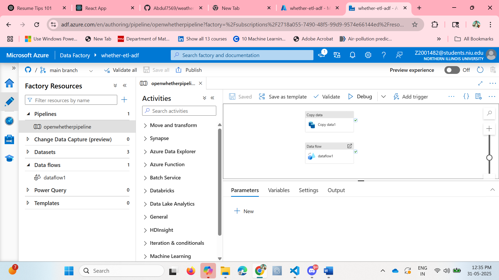
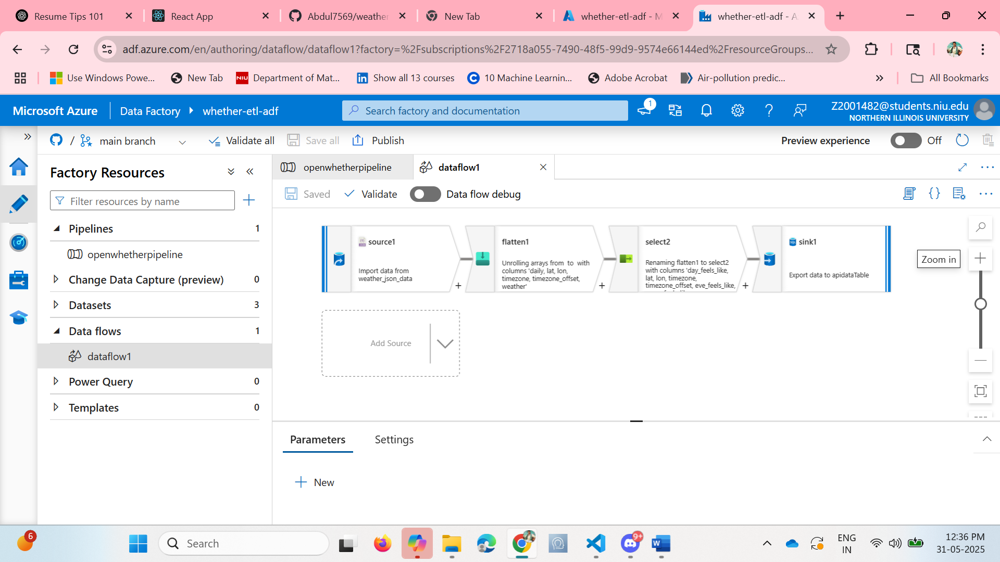

# 🌦️ OpenWeather API ETL Pipeline using Azure Data Factory

This repository contains the implementation of an end-to-end ETL (Extract, Transform, Load) pipeline built using **Azure Data Factory (ADF)** to process complex JSON weather data from the [OpenWeatherMap API](https://openweathermap.org/).

## 🚀 Project Overview

The goal of this project is to automate the extraction, transformation, and loading of real-time weather data using ADF and visualize it using Power BI for better insights and decision-making.
## Pipeline

## DataFlow


---

## 🔧 Pipeline Architecture

### 1. **Data Extraction** (ADF Copy Data Activity)
- **Source**: OpenWeatherMap REST API
- **Method**: ADF `Copy Data` activity under the **Move & Transform** category
- **Target**: Raw JSON data is ingested directly into **Azure Blob Storage**

### 2. **Data Transformation** (ADF Data Flow)
- Since the API returns a **nested JSON structure**, a **Mapping Data Flow** was used to:
  - **Flatten** complex arrays and objects
  - **Select** specific fields of interest (e.g., temperature, humidity, weather description, timestamp)
  - Clean and shape the data for downstream use

### 3. **Data Loading**
- Transformed data is loaded from Azure Blob Storage into **Azure SQL Database** for structured storage and querying.

---

## 🏗️ ADF Pipeline Details

- **Pipeline Name**: `OpenWeatherPipeline`
- **Components Used**:
  - `Copy Data` activity for API ingestion
  - `Data Flow` with Flatten and Select transformations
  - Sink to Azure SQL DB

---

## 📊 Power BI Integration

The final structured data in Azure SQL Database is connected to **Power BI**, where interactive **dashboards** are built to:

- Monitor real-time weather trends
- Visualize temperature, humidity, and other metrics
- Support better data-driven decisions

---

## 📁 Repository Contents

```plaintext
weatherAPI_etl_adf/
│
├── README.md                 # Project documentation
├── pipeline_templates/       # JSON templates for ADF pipelines
├── linked_services/          # Definitions for source and sink connections
├── datasets/                 # Input and output dataset definitions
└── data_flows/               # Mapping data flows used for transformation


---

## 🧠 Key Learnings

- Working with **nested JSON** structures and applying flattening techniques
- Leveraging Azure Data Factory’s **low-code transformation tools**
- Integrating cloud ETL with **Power BI** for real-time dashboarding

---

## 🔗 Connect

Feel free to check out my work and reach out if you have questions or suggestions:

- **GitHub**: [Abdul7569](https://github.com/Abdul7569)
- **LinkedIn**: [LinkedIn Profile](https://www.linkedin.com/in/abdul-kalam-pulicharla-1876541b3/)

---

> 📌 *This project demonstrates a modern ETL approach using cloud-native tools for scalable and insightful data engineering.*
